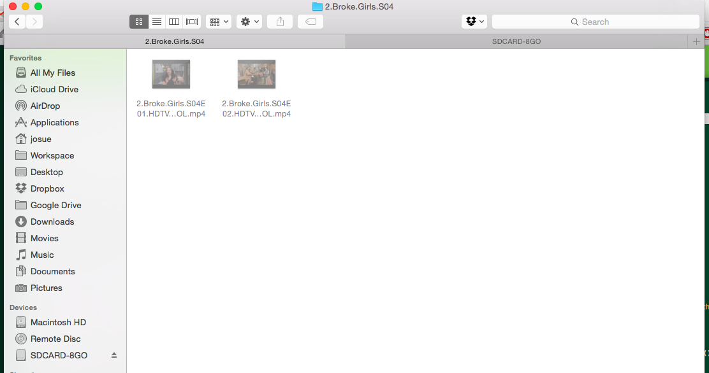
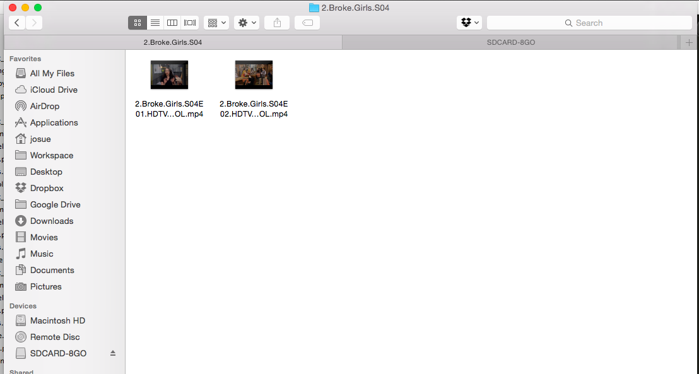

#Loking Fixers

A couple of my fixers in a python tool

#Version 0.1

#Features

#How To

##Installation

```shell
(test)josue@LokingMac:/private/tmp/lokingFixers-0.1$ python setup install
...
(test)josue@LokingMac:/private/tmp/lokingFixers-0.1$
```

##Settings

You can find and edit settings in ***~/.lokingfixers/settings.py***

## Home Directory Config Backup

```shell
(test)josue@LokingMac:~$lokingfixer.py -s
Archiving /Users/josue/.profile
Archiving /Users/josue/.pythonenv.py
Archiving /Users/josue/.emacs
Archiving /Users/josue/.vimrc
Archiving /Users/josue/.inputrc
Archiving /Users/josue/.gitconfig
Archiving /Users/josue/.pdbrc
(test)josue@LokingMac:~$
```

##BrokMac Fixer : Item is used by OSX



```shell
(test)josue@LokingMac:~$ lokingfixer.py -b /Volumes/TOSHIBA/Series/2.Broke.Girls.S04/
CHECKING FILES ...
/Volumes/TOSHIBA/Series/2.Broke.Girls.S04/2.Broke.Girls.S04E01.HDTV.x264-LOL.mp4 is used by OSX
/Volumes/TOSHIBA/Series/2.Broke.Girls.S04/2.Broke.Girls.S04E02.HDTV.x264-LOL.mp4 is used by OSX
2 files fixed (^_^)
(test)josue@LokingMac:~$
```



```shell
(test)josue@LokingMac:~$ cat .lokingfixers/logs/log-06-11-2014-00-07.log
[fixer 2014-11-06 00:07:53,861 INFO]: CHECKING FILES
[fixer 2014-11-06 00:07:53,865 INFO]: /Volumes/TOSHIBA/Series/2.Broke.Girls.S04/2.Broke.Girls.S04E01.HDTV.x264-LOL.mp4
[fixer 2014-11-06 00:07:53,865 INFO]: /Volumes/TOSHIBA/Series/2.Broke.Girls.S04/2.Broke.Girls.S04E02.HDTV.x264-LOL.mp4
(all)josue@LokingMac:~/Dropbox/Workspace/loking/lokingFixers$
(all)josue@LokingMac:~/Dropbox/Workspace/loking/lokingFixers$ cat logs/report-06-11-2014-00-07.log
[fixer 2014-11-06 00:07:53,866 INFO]: 2 files fixed (^_^)
```